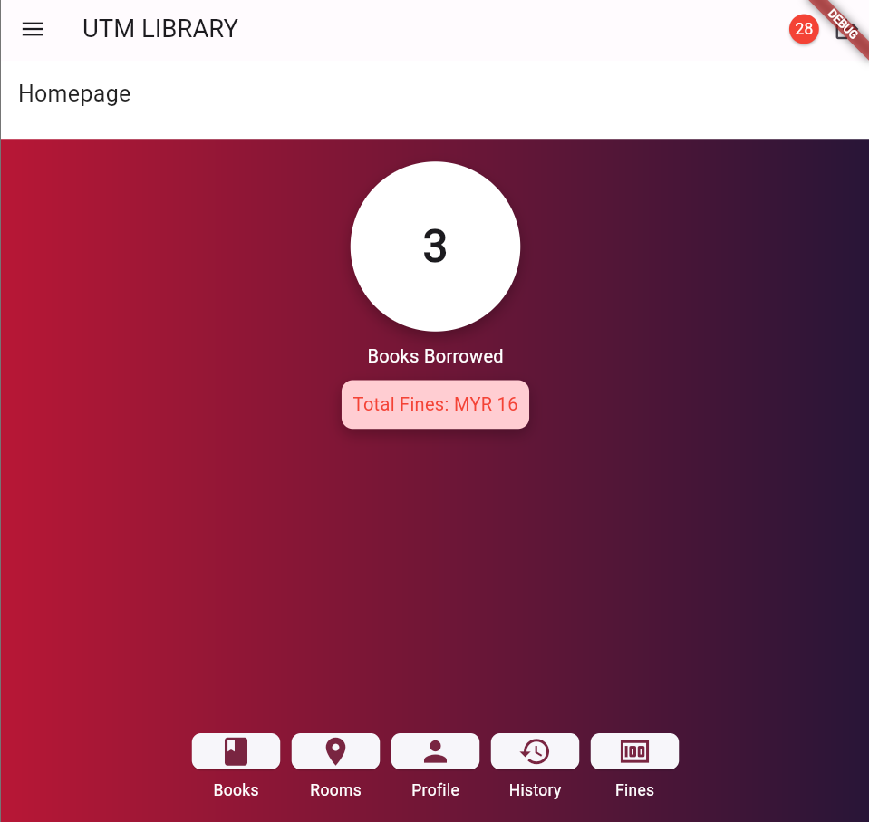

# library_app
 Library Management Application

Library App is a Flutter application designed for managing book reservations, fines, and other library functionalities. This app allows students and librarians to efficiently handle library operations.

## Features

- User authentication (login, registration, password reset)
- Book reservation and management
- Room reservation and management
- Fine calculation and history tracking
- Notifications for reservations and fines
- User profiles for students and librarians

## Screenshots




## Installation

### Prerequisites

- [Flutter SDK](https://flutter.dev/docs/get-started/install)
- [Firebase Account](https://firebase.google.com/)

### Steps

1. **Clone the repository:**
```sh
git clone https://github.com/yourusername/library_app.git
cd library_app
```
2. **Install dependencies:**
```sh 
flutter pub get
```

3. **Set up Firebase:**

- Create a Firebase project in the Firebase Console.
- Add Android and iOS apps to your Firebase project.
- Download the `google-services.json` (for Android) and `GoogleService-Info.plist`(for iOS) files and place them in the respective directories:
  - `android/app/google-services.json`
  - `ios/Runner/GoogleService-Info.plist`

4. **Run the app:**
 ```sh
 flutter run
 ```

## Contributing
We welcome contributions from the community. To contribute:

### 1. Fork the repository:

Click the "Fork" button on GitHub.

### 2. Clone your fork:

```sh
git clone https://github.com/NurainNajwa/library_app.git
cd library_app
```
### 3. Create a new branch:

```sh
git checkout -b feature/your-feature-name
```
### 4. Make your changes and commit:

```sh
git add .
git commit -m "Add new feature"
```
### 5. Push to your fork and create a pull request:

```sh
git push origin feature/your-feature-name
```
### 6. Submit your pull request:

Go to the original repository on GitHub and create a pull request.

## Sign In as Librarian
email: `library@domain.com`
password: `library_utm`

## License
This project is licensed under the GPL-3.0-or-later License - see the LICENSE file for details.

## Acknowledgements
Thanks to the Flutter community for their support and contributions.
Special thanks to all contributors of this project.

Feel free to open issues or submit pull requests to improve the app!

This `README.md` provides a comprehensive guide to understanding, installing, contributing to, and building your Flutter library app. Adjust the content as necessary to fit your project's specifics.
